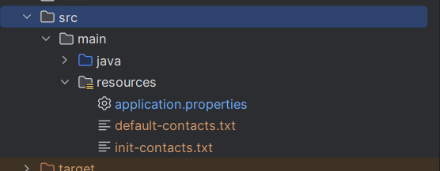
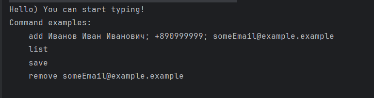

# 1.8 Практическая работа

## Предварительная настройка
Перед запуском программы нужно указать названия файлов 
для инициализации и загрузки данных в файле src/main/resources/application.properties

* `app.storage.filename` - файл, в который будут записываться сохраненные контакты
* `app.init.filename` - файл, откуда будут выгружены контакты при запуске приложения в режиме инициализации
* `spring.profiles.active` - чтобы перевести приложение в режим инициализации, нужно указать значение данного парметра init

### Пример настройки


Файлы должны находится в директории src/main/resources/


## Запуск приложения
После того как приложение было сконфигурировано, его нужно собрать.
Для этого введите в терминале команду ниже:
```shell
mvn package
```
После завершение сборки можно запустить проект.
Для этого введите следующую команду:
```shell
java -jar target\ConsoleCustomerList-1.0-SNAPSHOT.jar
```

## Описание работы
После запуска приложения будет выведено сообщение с перечнем доступных команд


### Список команд
* add - служит для добавления нового контакта в формат Иванов Иван Иванович; +890999999; someEmail@example.example
* list - выводит список ранее добавленных контактов
* save - сохраняет данные контактов в файл указанный в конфигурации `app.storage.filename`
* remove - удаляет ранее сохраненный контакт по email
* exit - выход из приложения